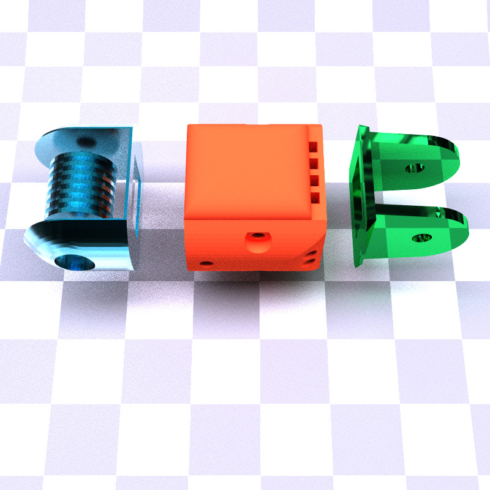

# PyPbrt: a Python wrapper for Pbrt-v3

## Recommended systems
- Ubuntu 18.04
- (Mini)conda 4.8.4 or higher
- GCC 7.5 (Other versions might work too but we tested the codebase with 7.5 only)

## Installation
```
git clone --recursive https://github.com/mit-gfx/py_pbrt.git
cd py_pbrt
conda env create -f environment.yml
conda activate py_pbrt
./install.sh
```

## Examples
Navigate to the `python/` folder and run `python [example_name].py` where `example_name` can be the following:
- `bunny`: A test scene for rendering a static Stanford bunny.

- `joint`: Another test scene for rendering multiple meshes.

- `moving_bunny`: A script to show how to render a triangle mesh in motion and export a video.